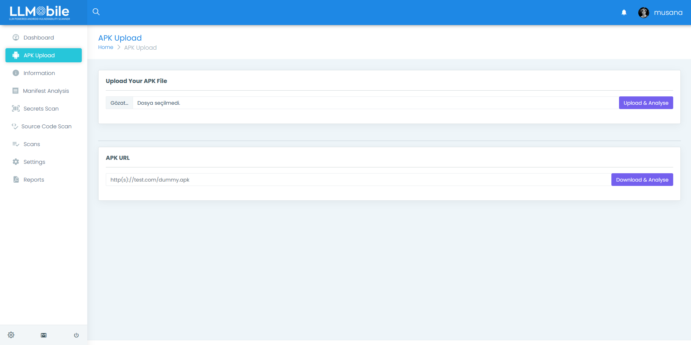
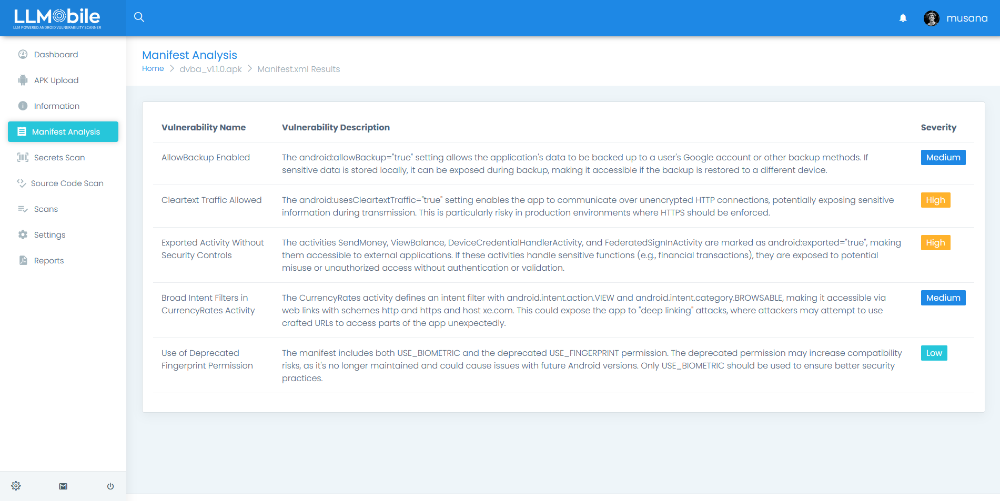
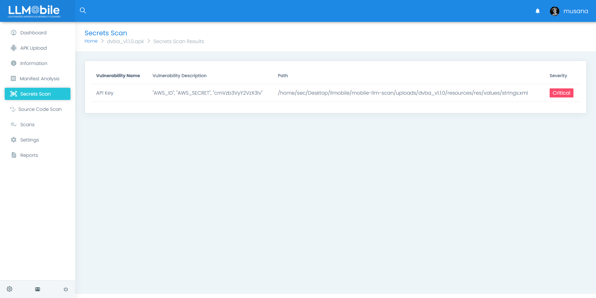
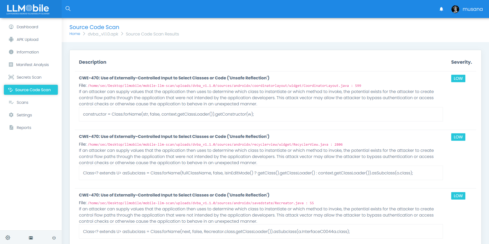
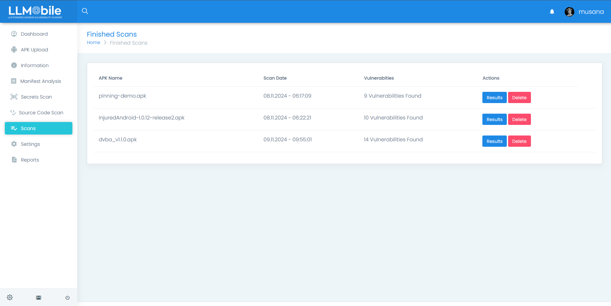

<div align="center">
    <h1>LLMobile</h1>
</div>

<div align="center">

</div>

<hr />

<p align="center">
  <a href="#introduction-the-importance-of-mobile-application-security">Why Mobile Security is important?</a> •
  <a href="#overview-of-the-tool-what-does-it-do">What's LLMobile</a> •
  <a href="#why-this-tool-is-different-from-traditional-scanners">How This Tool Stands Out</a> •
  <a href="#flow-chart-of-llmobile">Flow Chart of LLMobile</a> •
  <a href="#screenshots">Screenshots</a>
</p>


## Introduction: The Importance of Mobile Application Security

Mobile applications have become integral to the way businesses operate, engage with customers, and deliver services. Mobile apps handle vast amounts of sensitive information, such as user data, payment details, and authentication tokens. The increasing reliance on mobile devices for everyday activities has made them a prime target for cybercriminals.

Mobile app security is crucial for several reasons:

- Data Protection: Mobile applications often store and transmit highly sensitive data. Without proper security measures, this data can be exposed to malicious actors.
- Compliance: Many industries, such as healthcare and finance, are subject to strict regulations like GDPR, HIPAA, and PCI-DSS. A single security breach could lead to significant legal and financial consequences.
- Reputation: A security breach can damage a company’s brand reputation, erode user trust, and lead to loss of customers. In today’s competitive market, security is a key differentiator.
- Business Continuity: Securing mobile applications ensures business operations can continue without interruption. A breach or a security incident can lead to downtime, affecting the overall service delivery.

Therefore, ensuring the security of mobile applications is no longer optional, but a critical component of any development and operational strategy.

## Overview of the Tool: What Does It Do?

This tool is a comprehensive mobile application security vulnerability scanner designed to identify and mitigate potential security risks within mobile applications. It leverages Large Language Models (LLMs) to analyze various components of a mobile app’s codebase, such as the source code, configuration files, and secrets.

Key features of the tool include:

- Source Code Scan: The tool scans the mobile app’s source code to identify security vulnerabilities, insecure coding practices, and other potential risks, providing insights on code security and compliance.
- Secret Scan: It detects hardcoded secrets, credentials, API keys, or sensitive data embedded within the source code. Such secrets can often be overlooked by traditional scanning tools but pose a significant risk if exposed.
- Reporting: After scanning, the tool generates detailed reports highlighting vulnerabilities, risks, and compliance gaps, along with actionable remediation steps.
- LLM-based Analysis: The tool uses the power of Large Language Models to understand code semantics and detect subtle security vulnerabilities that might not be evident in traditional static analysis.
- CI/CD Integration: It can be easily integrated into the CI/CD pipeline, ensuring that mobile app security is continuously tested throughout the development lifecycle. This enables security to become part of the development process, rather than a reactive measure.

## Why This Tool is Different from Traditional Scanners
Traditional mobile security scanners primarily focus on static code analysis, looking for known patterns or signatures of vulnerabilities. While effective, these tools can miss vulnerabilities that are context-dependent, deeply embedded within business logic, or not easily identifiable by rule-based systems. They also often require manual intervention for complex issues and lack the flexibility to adapt to modern coding practices.

What sets this tool apart is its use of Large Language Models (LLMs) to enhance the scanning process. Here’s how it differs:

- Context-Aware Analysis: LLMs understand the context of the code, identifying vulnerabilities based on the actual purpose and flow of the application. This is a step beyond simple pattern matching.
- Intelligent Risk Identification: The tool can detect nuanced security risks that traditional static analyzers might overlook, such as improper API usage or insufficient input validation.
- Continuous Learning: The LLM-powered approach enables the tool to continuously improve and adapt to emerging security threats and new coding techniques, ensuring it stays up-to-date with evolving security practices.
- Advanced Secret Detection: The tool leverages advanced techniques to uncover hardcoded secrets or sensitive data embedded within the app, a feature often underdeveloped in traditional scanners.

In essence, this tool offers a more intelligent, adaptable, and comprehensive approach to mobile app security testing, going beyond what traditional static analysis tools can provide.

## Integration with CI/CD Pipelines
One of the key features of this tool is its seamless integration with CI/CD pipelines, which are commonly used by development teams for continuous integration and deployment. With the increasing adoption of Agile and DevOps methodologies, security is no longer a final step but an ongoing process throughout the software development lifecycle.

By integrating this tool into a CI/CD pipeline, businesses can:

**Automate Security Scanning:** Every code change that is pushed into the repository is automatically scanned for vulnerabilities, secrets, and other risks.  
**Shift Left in Security:** The tool allows for a "shift-left" approach to security, where issues are detected early in the development process rather than after deployment. This reduces the time and cost of fixing issues later.  
**Continuous Monitoring:** The CI/CD integration ensures that mobile apps are continuously monitored for security risks, even as new features and code updates are being added.  
**Faster and More Secure Releases:** With automated security checks as part of the CI/CD process, developers can quickly identify and fix vulnerabilities, allowing for faster release cycles without sacrificing security.  

By incorporating this tool into their development workflows, businesses can build security directly into their app development process, minimizing the chances of a breach while maintaining agile development practices.


## Flow Chart of LLMobile

```

                                                          +------------------------------------------+                                          
                                                          |                                          v                                          
                                                          |                          +-----------------------------+                            
                                                          |                          | Scan with Trational Methods |                            
                                                          |                          +-----------+-+-+--+----------+                            
                                                          |            +-------------------------+ | |  +-------------------------+             
                                                          |            |                  +--------+ +-------+                    |             
                                                          |            v                  v                  v                    v             
                                                          |  +-------------------+ +-------------+ +------------------+ +-------------------+   
                                                          |  | Manifest Analysis | | Secret Scan | | Source Code Scan | | Open Source Tools |   
                                                          |  +----+--------------+ +------+------+ +--------+---------+ +---------+---------+   
                                                          |       |                       |                 |                     |             
                                                          |       | +---------------------+                 |                     |             
                                                          |       | |                                       |                     |             
                                                          |       | | +-------------------------------------+                     |             
                                                          |       | | |                                                           |             
                                                          |       | | | +---------------------------------------------------------+             
+-------+        +----------+        +---------------+    |       | | | |                                                                       
|  APK  +------> | LLMobile +------> | Decompile APK +----+       | | | |                                                                       
+-------+        +----------+        +---------------+    |       | | | |                                                                       
                                                          |       | | | |                                                                       
                                                          |       | | | |                                                                       
                                                          |       | | | |                                                                       
                                                          +-------+-+-+-+------------------------------+                                        
                                                                  | | | |                              |                                        
                                                                  | | | |                              v                                        
                                                                  | | | |                    +-------------------+                              
                                                                  | | | |      +-------------+   Scan with LLM   |-------------------+          
                                                                  | | | |      |             +-------------------+                   |          
                                                                  | | | |      |                 |             |                     |          
                                                                  | | | |      |                 |             |                     |          
                                                                  | | | |      |                 |             |                     |          
                                                                  v v v v      v                 |             |                     v          
                                                             +-----------------------+           v             v            +------------------+
                                                             |        Eliminate      |  +----------------+  +------------+  |     Semantic     |
                                                             |False-Positive Findings|  |Source Code Scan|  |Secrets Scan|  |  Business Logic  |
                                                             |in Traditional Scanning|  +---------+------+  +------+-----+  |Vulnerability Scan|
                                                             +-----------+-----------+            |                |        +---------+--------+
                                                                         |                        +---+ +----------+                  |         
                                                                         +--------------------------+ | | +---------------------------+         
                                                                                                    | | | |                                     
                                                                                                    v v v v                                     
                                                                                              +------------------+                              
                                                                                              |                  |                              
                                                                                              |LLMobile Dashboard|                              
                                                                                              |                  |                              
                                                                                              +------------------+                              

```


## Screenshots












---

#### To Do
- Supporting iOS
- Notification system
- Supporting local LLM models
